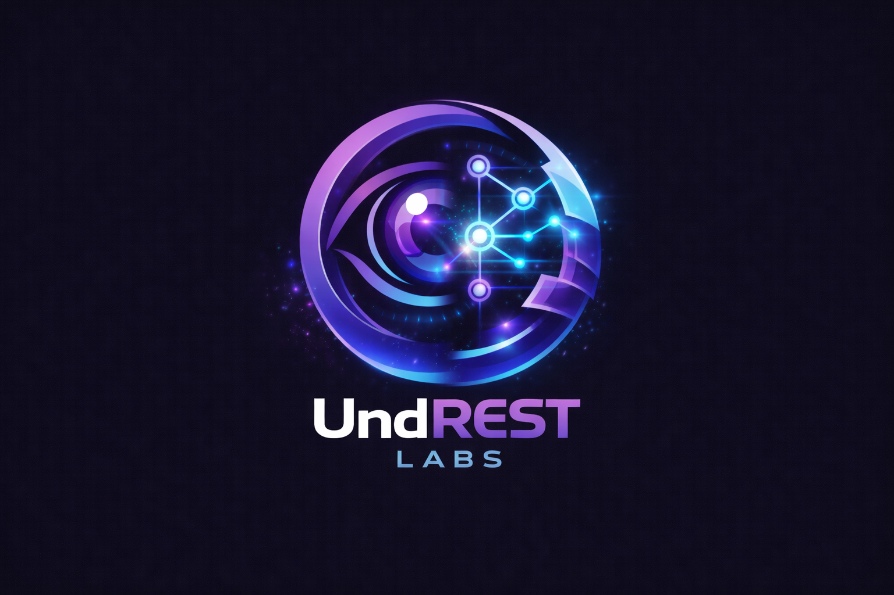
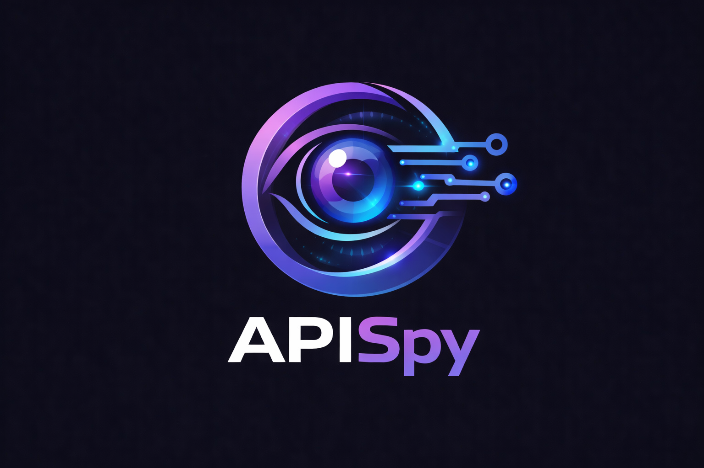
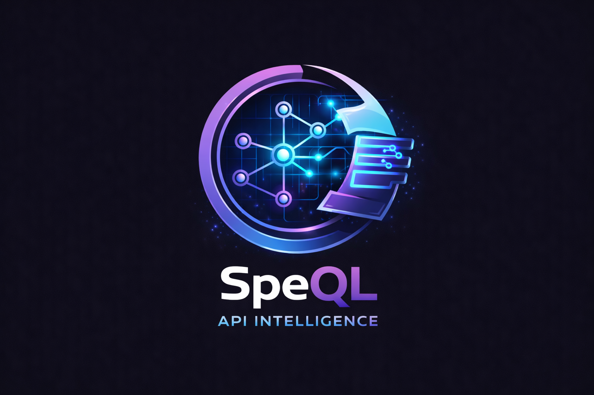
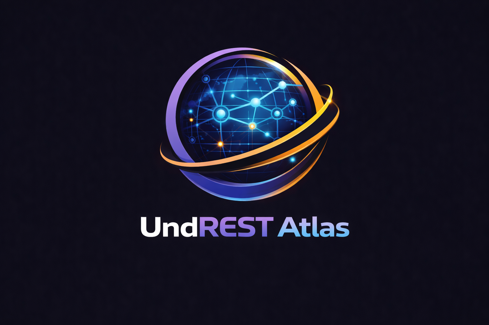

## UndREST Labs

> **Understand APIs as they actually behave - not as they are documented.**

---

## ⚡ Why UndREST exists

> Built from real-world research into how APIs behave in practice — not in documentation.

Cloud and SaaS platforms expose vast API surfaces.

Documentation tells you what *should* happen.

Reality is what your tenant is actually doing right now.

Those two things are rarely the same.

UndREST Labs is focused on closing that gap.

---

## 🧠 The model
Observe → Understand → Map → Evolve

---

## 🔍 Projects

### 👁️ APISpy *(in-development)*
Real-time visibility into API calls as they happen.

- Inspect live traffic in your browser
- Compare against known API specs  
- Identify undocumented or unexpected behaviour  

---

### 🧠 SpeQL *(in-development)*
Query and reason about API behaviour.

- Analyse patterns across API specifications  
- Detect known anti-patterns across all documented API specs
- Turn raw API activity into insight - SpeQL is the engine that feeds APISpy

---

### 🌍 Atlas *(future)*
Mapping API ecosystems at scale.

- Continuous tenant analysis  
- Behavioural baselining  
- "Spec vs Reality" at enterprise scale  

---

## 🚧 Status

This is an active research and development space.

Initial releases are being prepared.  
Expect rapid iteration and occasional chaos.

---

## 🤝 Follow the journey

- Blog: https://cirriustech.co.uk  
- Research drops: coming soon  
- GitHub repos: in progress  

---

## 💬 Philosophy

> Assumptions have teeth.  
> Reality is the source of truth.  
> Capability ≠ intention.

---

## ⚠️ Disclaimer

This is research tooling intended for defensive security, analysis, and understanding complex API ecosystems.

Use responsibly.
